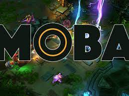

## As a rookie
As a gamer, one of the most important aspects of playing a MOBA game is to understand how to build your item. The first time I played a MOBA game. I will choose the building that has the highest win rate and usage rate, because it is a safe choice that has been proven to work by a lot of players.

After becoming more familiar with the game, I will decide to make some modifications to the basic building. Such as changing the order of the item or changing one of the item. The ultimate goal is to improve my game winning rate and game experience.

## Budding pattern vs. design pattern


Just as there are many different item combinations that we can use in the MOBA game, there are many different design patterns we can use for software development. Some design patterns are well-known and widely used, while others are more specialized and less common.

As beginners, we often come into contact with this well-known design pattern at the beginning, maybe like the Singleton pattern or the Prototype pattern. After getting a better understanding of this software, we will gradually find a design pattern that is more suitable for us.

This is the code from our final project. In this code we have been use Prototype pattern and Singleton pattern.

```cpp
import { Mongo } from 'meteor/mongo';
import SimpleSchema from 'simpl-schema';

/** Encapsulates state and variable values for this collection. */
class RecipesCollection {
  constructor() {
    // The name of this collection.
    this.name = 'RecipesCollection';
    // Define the Mongo collection.
    this.collection = new Mongo.Collection(this.name);
    // Define the structure of each document in the collection.
    this.schema = new SimpleSchema({
      name: { type: String, index: true, unique: true },
      owner: String,
      image: { type: String, optional: true },
      instructions: { type: String, optional: false },
      time: { type: String, optional: false },
      servings: { type: Number, optional: false },
      vegan: { type: Boolean, optional: true, defaultValue: false },
      glutenFree: { type: Boolean, optional: true, defaultValue: false },
    });
    // Ensure collection documents obey schema.
    this.collection.attachSchema(this.schema);
    // Define names for publications and subscriptions
    this.userPublicationName = `${this.name}.publication.user`;
    this.vendorPublicationName = `${this.name}.publication.vendor`;
    this.adminPublicationName = `${this.name}.publication.admin`;
  }
}

export const Recipes = new RecipesCollection();
```

In conclusion, whether we are building items in a MOBA game or designing software. The most important thing is to lay a solid foundation. Then on this basis we can improve and innovate our own code.