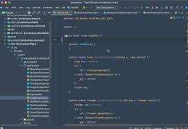

## Intellij IDEA

At the beginning of contact with ESlint in intellij, I feel stressed because there is a lot of stuff that I need to do. However, my worries are unnecessary. After I used intellij IDEA, I found it greatly improved my efficiency.

The use of shortcut keys saves me a lot of time. In IntelliJ IDEA, you have shortcuts for nearly every action, including selection and switching between the editor and various tool windows.

IntelliJ IDEA supports using multiple languages. For example ,we can have html files and javascript files together.  IntelliJ IDEA also includes a terminal for working with a command-line shell from inside the IDE.

## ESlint

What impresses me the most is the ESlint. First of all, we should understand the importance of coding standards.

Assuming we don't have coding standards, then when we do group projects, everyone's code has its own characteristics, which is very unfavorable for other people's reading. The unified style greatly improves the readability of the code, and people will feel familiar when they see any piece of code. Obviously, standardized code is beneficial and necessary in the collaborative development of the team.

Coding standards are helpful for us to modify the code later. Assuming you are going to modify a piece of code that you wrote a year ago, you will find it is easy to modify your code, because even after a year you are still writing code according to the coding standards. On the contrary, you will find that you need to spend a long time to get familiar with this code even if it is written by yourself. In the beginning, it was painful when we got a lot of red checkmarks. But when we are familiar with coding standards, we will get less and less red checkmarks.

This is a process of continuous improvement, and it is also an important process that determines whether you can develop good coding habits

