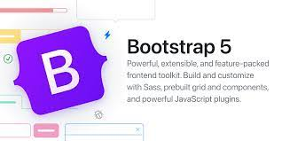

## Working with Boostrap 5

After one week working with Boostrap 5, I find that using UI Framework can greatly save time and improve work efficiency. Before touching it, I thought it was an independent software that needs to be installed and downloaded, then I can use it. It is easier to use Boostrap 5 than I thought, I just need to copy some code into Intellij Idea and strat working with it.

```cpp
<meta name="viewport" content="width=device-width, initial-scale=1">
<link href="https://cdn.jsdelivr.net/npm/bootstrap@5.2.3/dist/css/bootstrap.min.css" rel="stylesheet">
<script src="https://cdn.jsdelivr.net/npm/bootstrap@5.2.3/dist/js/bootstrap.bundle.min.js"></script>
```

However working with Boosrap is a little bit confusing at the beginning, because we may not be familiar with the forms or layout. We will get in return for the investment of time and frustration, but after that your work will become more efficient and your thinking will be more clear. 

## Benefits

<img width="300px" src="../img/uiframe.png"

Using UI Frameworks are also a lot of benefit for software engineers.

First, using UI Frameworks saves a lot of time, the engineers do not need to worry about how to work with the UI, there is already a frame there. Therefore, engineers can have more time to work with software development.

Second, Bootstrap 5 supports the latest, stable releases of all major browsers and platforms. Thus, it can perform well on Chrome, IE or Firefox.

Third, Many websites also use Bootstrap 5 as the UI Framework. Therefore, many users are already familiar with this framework. They can easily use the website and understand the application even though it's the user's first time opening this website.