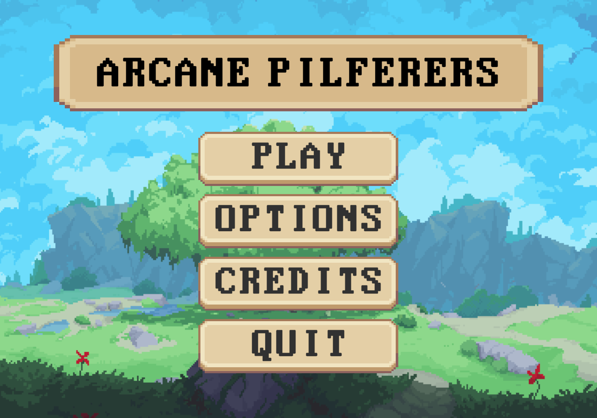

## Overview
**Arcane Pilferers** is a 2D platformer built by a **team of four** during an **8-week game development class** in Unity.  
Legends speak of a colossal, universe-spanning tree. By navigating dimensional rifts and channeling three magical crystals near each rift’s opening, adventurers can reach the tree’s core where a grand treasure lies.

You’ll battle foes across shifting worlds, **harvest souls** to power spells, and **channel mana at shrines** to upgrade yourself **every run**. Even in defeat, progression persists—capturing a roguelike loop of steady growth.

---

## Features

- **Rift Navigation & Crystals**: Collect and channel three magical crystals to focus rifts and advance toward the world-tree’s core.  
- **Action Combat & Spells**: Take on assorted enemies, collect their souls, and cast spells to turn the tide.  
- **Persistent Progression**: Spend mana at shrines to upgrade stats and abilities; growth carries across runs.  
- **Unity Build**: Designed and implemented within an 8-week timeline by a four-person team.

 

- **Controls**  
  - Attack: **Left Click** or **J**  
  - Cast Spell: **Right Click** or **K**  
  - Take Spell: **F**  
  - Dodge: **Shift**  
  - Jump: **Space**

---

## My Role (Music & Audio in Unity)
I owned the **music and sound integration**:
- Composed background tracks for exploration and combat, matching each world’s tone.  
- Authored **audio cues** for spells, shrines, and enemy actions to reinforce gameplay feedback.  
- Integrated assets via **Unity’s audio system** and mixers to ensure smooth transitions and consistent levels.

---

## Tech
- **Engine**: Unity  
- **Languages**: C#  
- **Audio**: Unity Audio (mixers, snapshots, events)  
- **Team**: 4 developers (design, programming, art, audio)

---

## Future Plans
There’s plenty of room to grow beyond the class scope:
- Proper randomization of **level tilesets**  
- **More enemy types**, **more spells**, and **more complex boss fights**  
- Additional **playable characters** and **upgrade paths**  
- A more **unified art style**, improved **shaders** and **lighting**  
- **Metroidvania**-inspired progression to encourage exploration and replayability

---

- [Live Demo](https://skittflash.itch.io/arcane-pilferers)  
