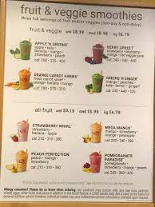

  

This program allowed customer to order for one or more drinks and also make an inventory to determines whether or not it has sufficient ingredients to make the drink.

Here is some code :

```cpp
class MenuItem{
	constructor (name,ingredients,prices,calories){
  	this.name = name;
  	this.ingredients = ingredients;
  	this.prices = prices;
  	this.calories = calories;
  }
}

const papayaSunrise = new MenuItem ("Papaya Sunrise", ["papaya","strawberry","peach"], {small : 5.15, medium : 5.75, large : 6.55}, {small : 190, medium : 280, large : 330});
const peachPerfection = new MenuItem ("Peach Perfection", ["peach","mango","strawberry"], {small : 5.15, medium : 5.75, large : 6.55}, {small : 210, medium : 320, large : 360});
const strawberryDragon = new MenuItem ("Strawberry Dragon", ["pitaya","strawberry","orange","passionfruit","mango","banana"], {small : 5.85, medium : 6.25, large : 6.85}, {small : 360, medium: 480, large : 610});
const strawberryWhirl = new MenuItem ("Straberry Whirl", ["straberry","banana","apple"], {small : 5.15, medium : 5.75, large : 6.55}, {small : 210 , medium : 310, large : 380});
```

You can learn more at the [Sourse](https://jsfiddle.net/jianlongchen/rzvwpeos/33/).
