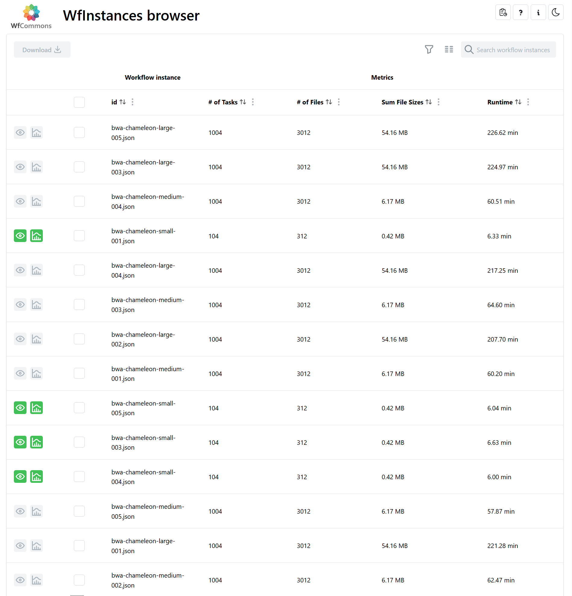

## Overview
This project was completed as part of ICS 496, my Computer Science capstone course. The goal was to simulate real-world software development, from planning to delivery, in a collaborative team environment.  

The **WfInstances Browser** is a web application that allows researchers to browse, download, simulate, and visualize workflow instances from **WfCommons** repositories. Our team focused on improving usability and implementing new features.

---

## Key Features

- **Usage Report Modal**  
  Interactive visualization of usage metrics (downloads, simulations, visualizations) with customizable date ranges. Includes a sidebar showing the top user countries using **IPInfo** geolocation.

- **User Feedback Pop-ups**  
  Occasional questionnaires triggered by user activity to collect usability feedback.

 

- **Performance Improvements**  
  Fetch workflow JSON data using Python's **git** package instead of the GitHub REST API for better performance.

- **GitHub Actions Integration**  
  Automated updates of usage statistics displayed directly in the project README.

 

---

## Technologies Used
- **Frontend:** TypeScript, React  
- **Backend:** Python, REST API  
- **DevOps:** Docker, GitHub Actions  
- **Other:** IPInfo API, Full-stack development  

---

## Project Presentation
We showcased our work during **ICS Project Day**, including a live demo and a poster presentation. This project gave me hands-on experience in full-stack development, real-world problem-solving, and collaborative software engineering.

---

- [Live Demo](https://wfinstances.ics.hawaii.edu/)  
- [Project Repository](https://github.com/wfcommons/WfInstances)  
- [More detail](https://wfinstances.github.io/)

