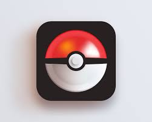

  


The Pokemon GUI have two sections. The top section will be for catching Pokemon. the program will catch Pokémon, and Pokémon has a chance to escape. Simulated the scene of capturing Pokémon in the animation, the trainer has a chance to use the ball to capture the Pokémon, but if the Pokémon runs out of the ball, it means that the capture fails

The bottom section will be like your "backpack" and will display the list of captured Pokemon in various ways.

Here is part of the code:

```cpp
import java.util.Random;
import java.awt.*;
import javax.swing.*;
import java.awt.event.*; //add this for the listener

/**.
* PokemonPanel for PokemonGUIJianlong.java
* @author JianlongChen
* @since 2020/12/10
*/

public class PokemonPanel extends JPanel {

  /********* label. ************/
   private JLabel lTitle = new JLabel("Pokemon Available");

   private JLabel lMsg = new JLabel("                ");
   

  /******* button. ****************/
   private JButton bDone = new JButton(" Make Pokemon ");
  
   private JButton bClear = new JButton(" Clear ");
  
   private JButton bList = new JButton("List Pokemon"); 
   
   /******* sub-panel. ***********/
   private JPanel firstSubpanel = new JPanel();  
   private JPanel secondSubpanel = new JPanel(); 
   private JPanel thirdSubpanel = new JPanel(); 
   private JPanel fourthSubpanel = new JPanel();
```

You can learn more at the [Sourse](https://github.com/jianlongchenn/jianlongchenn.github.io/blob/main/PokemonPanel.java).
